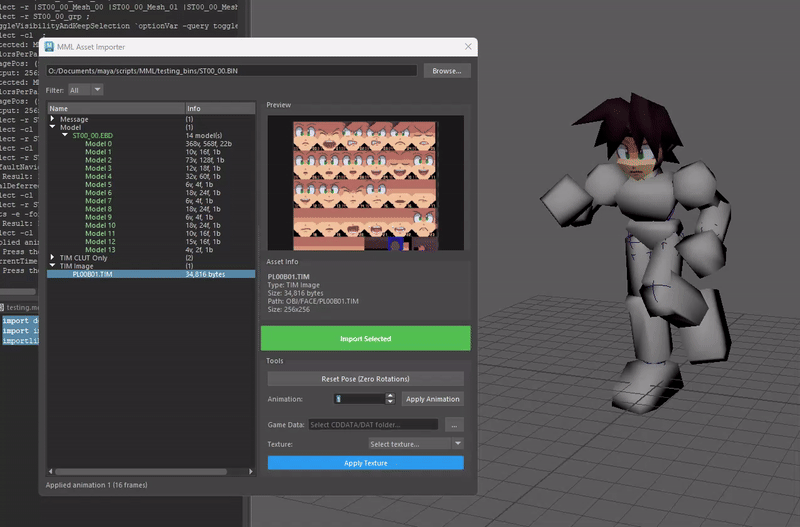

# MML Maya Tools

> **Note**: This project is currently a **Work in Progress**.

A purely Python-based asset pipeline tool for importing **Mega Man Legends (PS1)** assets into Autodesk Maya. This toolset bridges the gap between retro console formats and modern DCC applications, focusing on accurate preservation of the original "action figure" segmentation and animation style.

## Key Features

- **Custom Binary Parsing**:
  - Implements a full reader for the proprietary `.ebd` (Entity/Model) and `.tim` (Texture) PS1 formats.
  - Handles legacy fixed-point arithmetic (12-bit packed coordinates) and PS1 specific coordinate spaces.

- **Maya Integration**:
  - **Direct Import**: Reconstructs models, skeletons, and materials directly in Maya using `maya.api.OpenMaya` and `maya.cmds`.
  - **Rigid Binding**: Automatically sets up "action figure" style rigging (100% weight per limb) to replicate the original game's look and feel, avoiding modern vertex blending artifacts.
  - **Animation Support**: Parses and applies original frame-based animations to the generated skeleton.

- **Dependency-Free FBX Export**:
  - Features a custom-written **ASCII FBX 7.4 exporter** built from scratch.
  - Generates valid FBX files with skeletal hierarchies and animation data without relying on the official Autodesk FBX SDK.

- **Texture Management**:
  - Includes a database system to map models to their correct texture pages and palettes (CLUTs).
  - Handles UV space conversion and texture compositing.

## Usage

This tool is intended strictly for **research and preservation purposes only**.

It serves as a technical study of legacy game engine architecture and asset pipelines. Please respect the original copyright holders; this tool should not be used to infringe on intellectual property rights.
